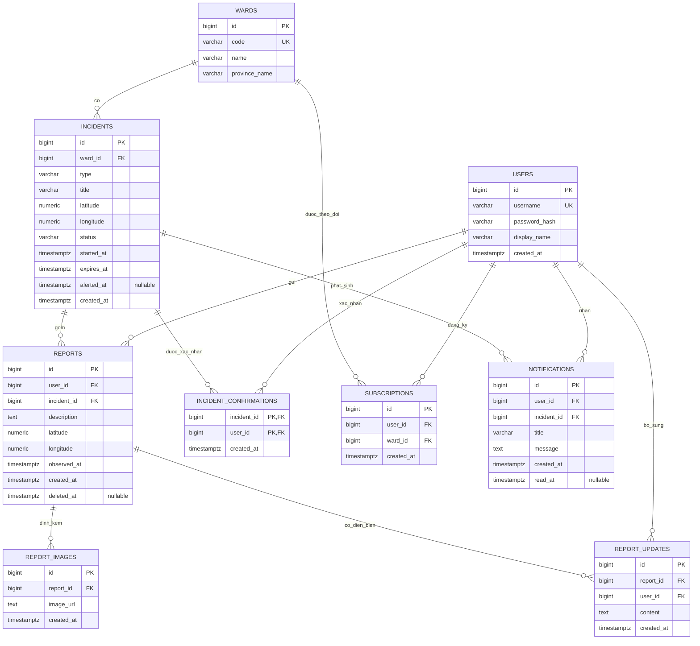

```mermaid
erDiagram
    USERS ||--o{ REPORTS : "gui"
    USERS ||--o{ INCIDENT_CONFIRMATIONS : "xac_nhan"
    USERS ||--o{ SUBSCRIPTIONS : "dang_ky"
    USERS ||--o{ NOTIFICATIONS : "nhan"
    USERS ||--o{ REPORT_UPDATES : "bo_sung"
    WARDS ||--o{ INCIDENTS : "co"
    WARDS ||--o{ SUBSCRIPTIONS : "duoc_theo_doi"
    INCIDENTS ||--o{ REPORTS : "gom"
    INCIDENTS ||--o{ INCIDENT_CONFIRMATIONS : "duoc_xac_nhan"
    INCIDENTS ||--o{ NOTIFICATIONS : "phat_sinh"
    REPORTS ||--o{ REPORT_IMAGES : "dinh_kem"
    REPORTS ||--o{ REPORT_UPDATES : "co_dien_bien"

    USERS {
        bigint id PK
        varchar username UK
        varchar password_hash
        varchar display_name
        timestamptz created_at
    }

    WARDS {
        bigint id PK
        varchar code UK
        varchar name
        varchar province_name
    }

    INCIDENTS {
        bigint id PK
        bigint ward_id FK
        varchar type
        varchar title
        numeric latitude
        numeric longitude
        varchar status
        timestamptz started_at
        timestamptz expires_at
        timestamptz alerted_at "nullable"
        timestamptz created_at
    }

    REPORTS {
        bigint id PK
        bigint user_id FK
        bigint incident_id FK
        text description
        numeric latitude
        numeric longitude
        timestamptz observed_at
        timestamptz created_at
        timestamptz deleted_at "nullable"
    }

    INCIDENT_CONFIRMATIONS {
        bigint incident_id PK, FK
        bigint user_id PK, FK
        timestamptz created_at
    }

    SUBSCRIPTIONS {
        bigint id PK
        bigint user_id FK
        bigint ward_id FK
        timestamptz created_at
    }

    NOTIFICATIONS {
        bigint id PK
        bigint user_id FK
        bigint incident_id FK
        varchar title
        text message
        timestamptz created_at
        timestamptz read_at "nullable"
    }

    REPORT_IMAGES {
        bigint id PK
        bigint report_id FK
        text image_url
        timestamptz created_at
    }

    REPORT_UPDATES {
        bigint id PK
        bigint report_id FK
        bigint user_id FK
        text content
        timestamptz created_at
    }
```
